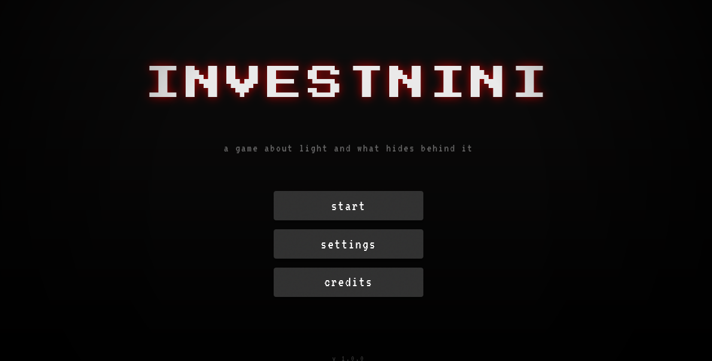
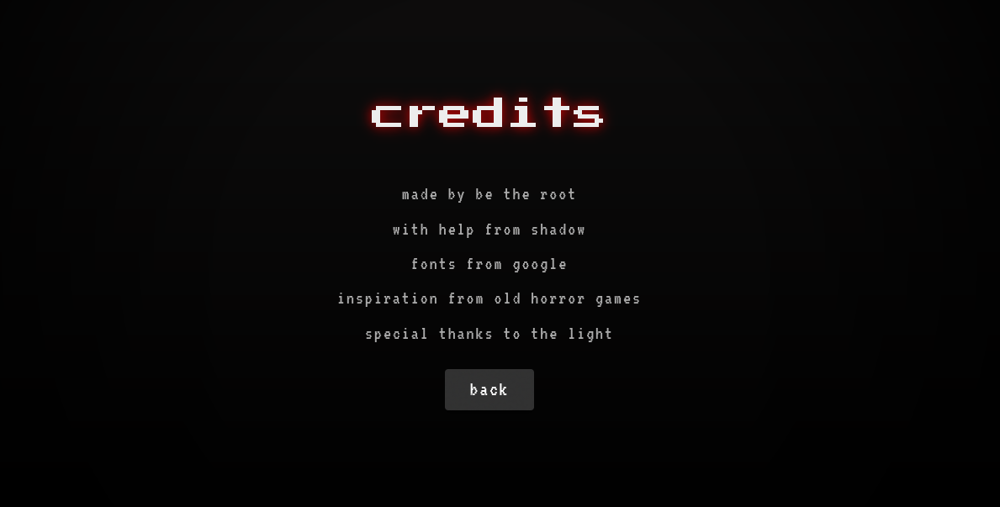

# investinini

> a game about light and what hides behind it

So basically its a horror game in a browser with no frameworks 
just with html css js


It's short, have fun


## What even is this

INVESTNINI is short, browser-based horror puzzle game. It stars you, a survivor of the fire happening at 2:45, who awakens in the dark room with non-working bulb and something that is not willing you to leave. Just 3 files for each page and the beauty of the dreams. It is the kind of game that you play for one session and then think about it for a while. Or maybe I'm just a sad person lol


## How to Play

1. Open the game in your browser
2. Click the lightbulb **10 times** to turn it on
3. Read the notes that appear (they matter)
4. Follow the instructions exactly
5. Don't die
6. Solve the final equation


## Screenshots






# Getting Started

### Dependencies

* Any modern web browser (Google Chrome, Mozilla Firefox, Microsoft Edge, Brave, etc.)
* No installation, compilers, or server dependencies required.

### Installing

1. Clone the repository or download the project files directly:
   ```bash
   git clone [https://github.com/be-the-root/investinini.git](https://github.com/be-the-root/investinini.git)
/
# help
feel free to open a pull request 

# licences

open for everyone 
mit
